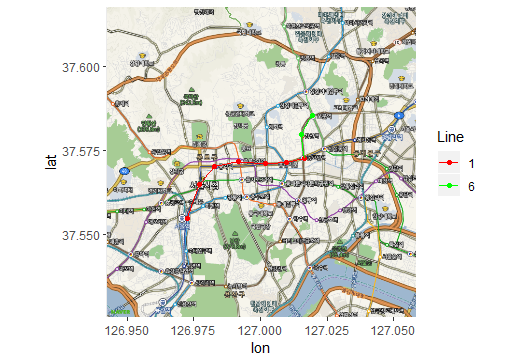
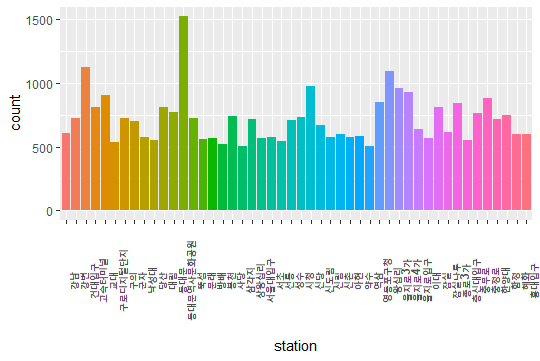

# seoulsubway

서울 지하철에 대한 내용이 담겨 있는 패키지입니다.  

이 패키지 내에는 서울 지하철에 대한 정보와 최단거리 함수 그리고 지도상의 표현이 가능한 함수가 포함되어 있습니다.

contact: kinh4k@g.skku.edu

<hr>

### _Install!_ 

devtools::install_github("king4k1/seoulsubway") 를 통하여 설치가능하며,

5000건의 경로 데이터샘플인 subway_sample를 이용하여 함수를 테스트하실 수 있습니다. 

```
if(!requireNamespace("devtools")) install.packages("devtools")
devtools::install_github("king4k1/seoulsubway")
```

<hr>

### `reconstruct_data()` 함수는 이용객 개별에 대한 raw_data 입력 시 패키지에 맞게 가공합니다.

```r
raw_data <- data.tabel::fread(file="")
reconstruct_data(raw_data, colname_list=c("departure","departure_line", "arrival","arrival_line"))
```

* 노선의 통일과 지선의 경우 새로운 노선으로의 정의

* 기본 몽촌토성(평화의문)과 같은 역명을 몽촌토성으로, 이수역과 총신대입구를 동일한 역명으로 변환

* raw_data의 경우, 컴퓨팅 속도를 위하여 data.table::fread()로 읽는 것을 권장함

<hr>

### subway_sample

총 5000건의 지하철 경로에 대한 정보를 포함하고 있습니다.

경로에는 1-8호선의 데이터만 고려합니다.

```r
library(seoulsubway)
data("subway_sample")
```

### 시간대 별 역 하차객수 확인 

```r
subway_count <- subway_sample %>% group_by(Time, down_Name) %>% summarise(N=n())

# 4개의 역에 대한 결과 (예시)
subway_count <- filter(subway_count, down_Name%in%c("강남","혜화","시청", "서울"))

ggplot(subway_count, aes(x=Time, y=N, col=down_Name)) + 
geom_line(position = 'jitter') + theme(legend.position="bottom")
```


<hr>

### `shortestpath()` 함수는 지하철 최단거리를 제공합니다.

총 13개의 노선(1-9호선과 신분당선, 분당선, 경의중앙선, 우이신설선)이 포함되어 있습니다.


### ex1. 먹골 -> 혜화
```r
shortestpath(departure="먹골", departure_line="7", arrival = "혜화", arrival_line = "4")
```


```r
shortestpath_plot(departure = "먹골", arrival = "혜화", google_key = private_key, zoom = 13)
```


### ex2. 태릉입구 -> 혜화
```r
shortestpath_plot(departure = "태릉입구", arrival = "혜화", google_key = private_key, zoom = 13)

```


### ex3. 보문 -> 서울
```r
shortestpath_plot(departure = "보문", arrival = "서울", google_key = private_key, zoom = 13)

```


### `get_total_count()` 함수는 모든 경로에 따른 역별 누적 경유회수 출력합니다.

* `get_path()` 함수를 통해서 제작한 277X277 경로 매트릭스 "subway_route" 에서의 binary한 결과를 이용하여 역별 총 누적 회수를 계산한다.

* 5000건의 subway_sample 데이터를 통하여 지하철의 혼잡도를 확인하자.

```r
total_count <- get_total_count(dat=subway_sample, departure_name = "up_Name", departure_line_name = "up_Line", arrival_name = "down_Name", arrival_line_name = "down_Line")

total_count_upper500 <- total_count[which(total_count$count>=500), ]
ggplot(data=total_count_upper500, aes(x=station, y=count, fill = station)) + geom_bar(stat="identity") +  theme(axis.text.x=element_text(angle=90, face="bold")) + theme(legend.position="none")
```



### `congestion_plot()` 함수를 통하여 서울지도 내 지하철 혼잡도 시각화가 가능합니다.

* 필요한 데이터셋의 형태는 vignette/Intro.pdf 를 참고하세요.

* 지도 상 시각화를 위하여, 구글 API key가 별도로 필요합니다. ?register_google을 참고하세요.

```r
congestion_plot(input_data=data_str_example, 
                center=c(126.97796919, 37.566535), zoom=11,
                google_key = API_key)
```

