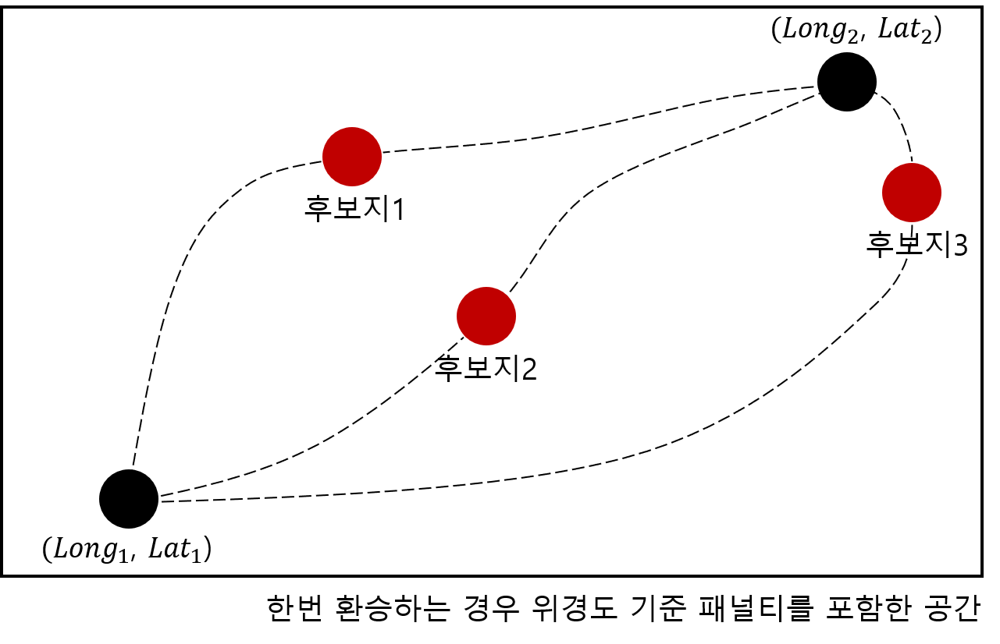
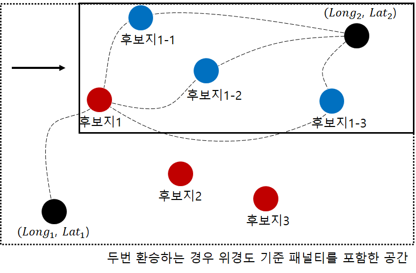

### 패키지 소개
* brute-force는 완전탐색 알고리즘으로 가능한 경우를 일일이 다 탐색하는 알고리즘입니다.

  * 하지만 이 알고리즘은 정확한 결과를 바탕으로 하지만 많은 시간이 소요되는 단점이 있습니다.

* seoulsubway는 최단경로 선정을 위하여 brute-force 알고리즘을 바탕으로 하지만 복잡한 서울 지하철 네트워크로 인하여 많은 시간이 소요되는 것을 다음과 같은 방법으로 개선시켰습니다.

  * 출발역과 도착역이 구성하는 사각형 형태의 공간으로 범위를 제약한다.
  
  * 제약한 공간 내 환승가능역을 이용하여 경로를 구성한다.
  
  * 환승가능역을 이용한 경로들을 비교하여 최단경로를 선정한다.
  

### 패키지 불러들이기 & 패키지 내장 데이터소개
```{r, message=FALSE}
#devtools::install_github("king4k1/seoulsubway")
library(seoulsubway)
```

```{r}
data("subway_sample")
data("subway_data")
data("subway_data_DT")
data("transfer_info")
data("transfer_station")
data("seoul_station")
data("seoul_route")
data("subway_route")


# subway_sample은 5000건의 샘플 경로를 포함합니다.
head(subway_sample)

# transfer_info는 환승역, 환승거리 및 소요시간 정보(서울교통공사 17.10 기준) 내용을 포함합니다. 이때 제공되지 않는 정보에 대하여 평균 환승시간 2.35(2분 21초) 입력하였습니다.
# 이세중. 환승 소요시간이 평균 2분 21초임을 고려해... [http://news.kbs.co.kr/news/view.do?ncd=3501669]
head(transfer_info)

# transfer_station은 모든 환승가능한 역에 대한 정보를 포함합니다.
head(transfer_station)

# subway_data는 지하철 1-9호선과 UI(우이신설), A(공항철도), K(경의중앙선), B(분당선),
# S(신분당선)에 대한 정보와 해당노선에 속하는 지선이 포함된 22개의 list형태의 데이터입니다.
names(subway_data)

# subway_data_DT는 subway_data에 속하는 모든 역들을 모아놓은 데이터테이블입니다.
head(subway_data_DT)

# seoul_route는 4월 한달동안의 데이터에서 포함한 유일한 형태의 지하철 역을 포함하였습니다.
head(seoul_route)

# subway_route는 위에서 소개한 seoul_route에 대한 정보를 이용하여 277x277행렬의 하삼각행렬에 해당하는 요소에 대한 정보를 포함한 데이터입니다.
subway_route[["혜화(4)-먹골(7)"]]
subway_route[["먹골(7)-혜화(4)"]]

```


### 최단거리 함수 내 내장함수 소개

* `get_pathinfo()` : 두 역 사이의 이동역수와 소요시간을 산출합니다. 
  
* `get_transfercriteria()` : 위경도를 기준으로 두 역 사이의 모든 환승가능한 역을 산출합니다.
  
* `get_transferinfo()` : get_transfercriteria를 통하여 산출된 환승가능 역들을 이용하여 두 역 사이의 모든 환승역에 대한 정보를 list형태로 산출합니다.
  
  
#### `get_pathinfo(total, start, end, line)`
* arguments
  
  * total : 노선의 총 역수
  
  * start : 출발역의 위치 index
  
  * end : 도착역의 위치 index
  
  * line : 노선명

* 2호선의 경우 순환 형태를 고려하였습니다.

* 6_A(응암순환)의 경우 단일방향으로의 이동만 가능한 것을 고려하였습니다.

```{r, warning=FALSE}
eval(get_pathinfo)
get_pathinfo(total=nrow(subway_data[["2"]]), start=10, end=15, line="2")

# 위 결과는 2호선 내 10번째 역과 15번째 역 사이의 소요시간과 이동회수를 산출하였습니다.
```

#### `get_transfercriteria(depart, arrival, penalty)`
* arguments 

  * depart : 출발역
  
  * arrival : 도착역
  
  * penalty : 공간 허락범위
  

```{r, echo=FALSE, out.width=450, fig.align="center"}

```

* 위 그림과 같이 penalty를 통하여 좀 더 넓은 기준을 주어 선택합니다.

* penalty는 환승역의 경우 우회하는 경로에 대한 정보를 포함하기 위하여 존재합니다.

```{r}
eval(get_transfercriteria)
get_transfercriteria(depart="먹골", arrival="혜화", penalty=0.05)
```

#### `get_transferinfo(depart, depart_line, arrival, arrival_line, n)`
* arguments 

  * depart : 출발역
  
  * depart_line : 출발노선
  
  * arrival : 도착역
  
  * arrival_line : 도착노선
  
  * n : 환승횟수

```{r, echo=FALSE, out.width=450, fig.align="center"}

```

* 예를 들어 2번 환승하는 경우 `get_transferinfo()` 함수가 작동하는 원리는 위 그림과 같습니다.

* 이때 count를 통하여 1,2,3번의 환승의 경우에 해당하는 환승 route를 제공합니다. 이 함수는 물론 get_transfercriteria가 매 단계 반복되는 구조로 제작하였습니다.(공간을 제약하는 방식을 사용합니다.)

* 함수 내부에 `checkline()` 이라는 함수를 두어 각 단계별 depart_line과 arrival_line을 기준으로 환승가능한 역에 대한 정확한 정보만을 선택하는 과정을 두었습니다.
```{r}
eval(get_transferinfo)
# 단계에 대한 설명은 공간을 제약하여 환승경유지를 산출하고, 환승경로가 동일한 역 혹은 결측값으로 나오는 경우는 제외한 정보를 포함하는 결과만을 산출함.
```

```{r, warning=FALSE}
get_transferinfo(depart="먹골", depart_line="7", 
                 arrival="혜화", arrival_line="4", n=1)

get_transferinfo(depart="먹골", depart_line="7", 
                 arrival="혜화", arrival_line="4", n=2)

get_transferinfo(depart="강동", depart_line="5_A", 
                 arrival="봉화산", arrival_line="6", n=3)
```


### 최단거리 함수 

* shortestpath_0() : depart_line과 arrival_line이 같은 경우 최단거리 경로를 산출합니다.

* shortestpath_1() : 환승을 한번만 하는 경로 중 최단경로를 산출합니다.

* shortestpath_2() : 환승을 두번 하는 경로 중 최단경로를 산출합니다.

* shortestpath_3() : 환승을 세번 하는 경로 중 최단경로를 산출합니다.

* shortestpath() : 지하철 최단경로를 제공합니다.

* 공통 arguments
  
  * depart : 출발역
  
  * depart_line : 출발노선
  
  * arrival : 도착역
  
  * arrival_line : 도착노선
  

#### `shortestpath_0(depart, depart_line, arrival, arrival_line)` 

```{r}
eval(shortestpath_0)
shortestpath_0(depart="먹골", depart_line="7", arrival="건대입구", arrival_line="7")
```


#### `shortestpath_1(depart, depart_line, arrival, arrival_line)` 

* get_transferinfo(..., count=1) 을 통하여 산출된 경로리스트를 후보군으로 최단경로를 선택합니다.

```{r}
eval(shortestpath_1)
shortestpath_1(depart="먹골", depart_line="7", arrival="혜화", arrival_line="4")
```


#### `shortestpath_2(depart, depart_line, arrival, arrival_line)`

* get_transferinfo(..., count=2) 을 통하여 산출된 경로리스트를 후보군으로 최단경로를 선택합니다.

```{r, warning=FALSE}
shortestpath_2(depart="먹골", depart_line="7", arrival="혜화", arrival_line="4")
```


#### `shortestpath_3(depart, depart_line, arrival, arrival_line)` 

* get_transferinfo(..., count=3) 을 통하여 산출된 경로리스트를 후보군으로 최단경로를 선택합니다.

```{r, warning=FALSE}
shortestpath_3(depart="강동", depart_line="5_A", 
               arrival="봉화산", arrival_line="6")
```


#### `shortestpath(depart, depart_line, arrival, arrival_line)` 

* 위 결과 중 depart_line==arrival_line의 경우, `shortestpath_0()`이 작동하고, depart_line!=arrival_line의 경우 환승을 두번까지 하는 방법 중 최단시간경로를 제공합니다.

* 효율적인 함수 구성을 위하여 환승을 2번까지 하여도 나오지 않는 경로에 대하여만 `shortestpath_3()`이 작동한 결과를 산출합니다.

```{r, warning=FALSE}
eval(shortestpath)
shortestpath(depart="강동", depart_line="5_A", 
               arrival="봉화산", arrival_line="6")
```


### 최단거리 함수를 이용한 분석함수

* `get_path()` : 지하철 최단경로에 해당하는 binary한 결과를 산출합니다.

* `get_total_count()` : `subway_route`를 통하여 데이터에 기반한 누적 경유회수를 산출합니다.

#### `get_path(depart, depart_line, arrival, arrival_line)` 

* `get_path()` 함수를 통하여 (1) 이동경로에 해당하는 역명을 산출합니다.
```{r, warning=FALSE}
get_path(depart="먹골", depart_line="7", arrival="혜화", arrival_line="4")
```

* `get_path()`를 통하여 2018.4월 데이터 중 유일한 역과 호선에 대한 쌍을 담고 있는 seoul_route(277가지 경우)에 대하여 `subway_route`를 제작하였습니다.

* `subway_route` 내에는 "출발역(출발호선)-도착역(도착호선)" 의 경우에 해당하는 총 38226가지의 경로에 대한 정보가 포함되어있습니다.

```{r}
subway_route[["가락시장(8)-강남(2)"]]
```


#### `get_total_count(dat, depart_name, depart_line_name, arrival_name, arrival_line_name)` 

* `subway_route`의 38226가지 경우는 277X277행렬의 하삼각행렬으로써 만약 경로가 없다면 상삼각행렬의 해당하는 경로를 산출하는 "도착역(도착호선)-출발역(출발호선)" 의 경우를 산출합니다.

* `subway_sample` 을 이용하여 5000개의 경로에 대한 누적결과를 산출하는데 5~6분 정도의 시간이 소요되는 것을 확인하였습니다. 

```{r}
total_count <- get_total_count(dat=subway_sample, depart_name = "up_Name", depart_line_name = "up_Line", arrival_name = "down_Name", arrival_line_name = "down_Line")
```

* 산출된 결과를 5000개의 경로에 대한 정보를 total_count에 저장한 후 500count 이상을 기록한 지하철역만을 산출하여 그림으로 그려보았습니다. 이러한 방식으로 다음단계의 분석이 가능할 것 같습니다.

```{r, fig.pos="H", fig.height=6, fig.width=6}
total_count_upper500 <- total_count[which(total_count$count>=500),]
ggplot(data=total_count_upper500, aes(x=station, y=count, fill = station)) + geom_bar(stat="identity") +  theme(axis.text.x=element_text(angle=90, face="bold")) + theme(legend.position="none")
```
